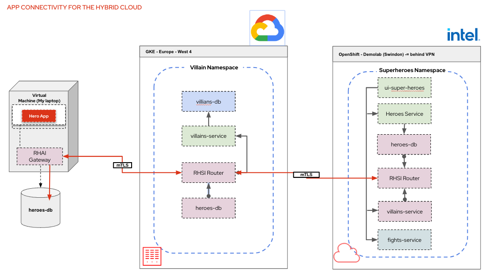

# Superheroes and Skupper demo

This demo focuses on Skupper configuration, Service Federatation and Remote database using GKE as part of the demo

## Introduction

The purpose of this demo is to show how easy it is to setup Skupper. I choose to use the Superheroes demo because its microservice architecure. It makes it very to use Skupper with.

The demo uses 1 OpenShift clusters and 1 GKE cluster, really doesn't matter which or where you deploy them. Clearly, the bigger the seperation, the more effective the demo is. I also use a local database running on my laptop.

Here is an architecture diagram of the application:


Here is how the distribution will be set up:

I have chosen to split the villain service out on to a seperate cluster using Skupper and exposing the service. 

For the Heroes service.... I have hosted a mysql DB on my laptop that containes a table with the data in.

The demo will use a Skupper Gateway to expose the mysql DB to the Skupper Virutal application network.

Having exposed the database, Debezium is used to replicated the database, and then replicate changes to Kafka (either running on the OpenShift cluster, or usinf RHOSAK).

A small Camel K Integration will read the messages from Kafka and route them to the Postgres DB, allowing the full application to work.

## Setting up the Demo

### Deploy 1 OpenShift cluster

For me, this runs in demolab, however, it could run anywhere

### Deploy 1 GKE cluster

Create VPC Network and subnet

Create GKE cluster

### Deploy the demo

Clone this repo so you can run the commands locally

#### Create the superheroes namespace in the OpenShift cluster 

```
oc new-project superheroes
```

#### Deploy the application into the superheroes namespace

* clone the repository

  ```
  git clone https://github.com/pprosser-redhat/quarkus-super-heroes.git
  ```

* deploy the whole application into the superheroes namespace

   cd to the root of the cloned project

   ```
   oc apply -f deploy/k8s/native-openshift.yml
   ```

   remove the villain service so it can be deployed in the other cluster

   ```
   oc delete all -l app.kubernetes.io/part-of=villains-service
   ```

   remove the heroes database
   ```
   oc delete all -l app=heroes-db
   oc delete all -l name=heroes-db 
   ```

   update the "rest-heroes-config" configmap
   
   change the property quarkus.hibernate-orm.database.generation=validate

   to

   quarkus.hibernate-orm.database.generation=none

* deploy the villain service to the GKE cluster

* Set enironment variable in the VM
  ```
  export KUBECONFIG=$HOME/.kube/config-gcp
  ```

* Initialise the connector to the GKE cluster and configure kubectl

  ```
  gcloud init
  ```

  Get the credentials for the cluster (change the name of the cluster and location accordingly)

  ```
   gcloud container clusters get-credentials villains-cluster --location europe-west4
  ```

* deploy the villain service

  ```
  oc apply -f rest-villains/deploy/k8s/native-java17-kubernetes.yml
  ```

  Demo code should all now be deployed

### Prepare terminal windows

In the terminal windows you are using for the skupper cli, ensure you set KUBECONFIG correctly

For the GCP site use (gateway window and villains window) :-
```
export KUBECONFIG=$HOME/.kube/config-gcp
```

For the on premises env use (superheros) :-

```
export KUBECONFIG=$HOME/.kube/config-coffee
```

# Demo Instructions

## Get the fight app up (URL will be different of course)

```
http://ui-super-heroes-superheroes.apps.rosa-zjs4n.tvaf.p1.openshiftapps.com/
```

## Initialise Skupper in each namespace

```
skupper init --site-name gcp
```

```
skupper init --site-name intel --enable-console --enable-flow-collector --console-auth openshift
```


## Link the sites together (most private to the most public)

Can do this in the consoles as well if you want 

In rosa window
```
skupper token create ~/gcp.yaml -t cert --name gcp
```
In intel window
```
skupper link create --name intel-to-gcp  ~/gcp.yaml
```

## Expose  the villain service on the intel side

```
skupper expose deployment rest-villains --port 8084 --protocol http
```
Check the game, villains should start appearing.... might need to refresh the page.

## Get data from my laptop by defining a skupper gateway on the gcp node

```
skupper gateway init --type podman
```

## Expose my database

```
skupper gateway expose heroes-db 10.0.2.2 5432 --protocol tcp --type podman
```

Test that I can connect to to DB, in a postgres pod on the villains project

```
psql --dbname=heroes_database --host=heroes-db --username=superman --password
```
```
select id, name, othername from hero;
select id, name, othername from hero where name = 'Chewbacca';
```

Test in the GKE cluster using the following commands to connect to bask in the cluster
```
kubectl get pods
```
Usig the correct podman 

```
kubectl exec --stdin --tty <change pod name> -- /bin/bash
```


