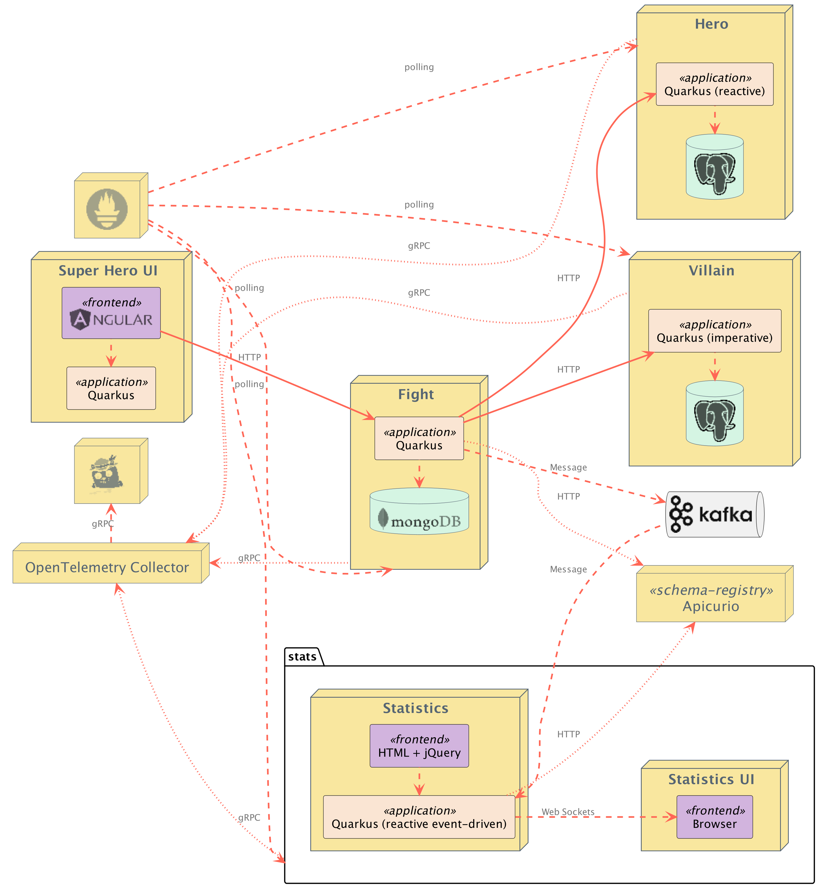
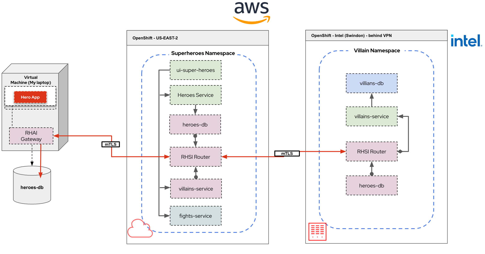

# Superheroes and Skupper demo

This demo focuses on Skupper configuration, Service Federatation and Remote database

## Introduction

The purpose of this demo is to show how easy it is to setup Skupper. I choose to use the Superheroes demo because its microservice architecure. It makes it very to use Skupper with.

The demo uses 2 OpenShift clusters, really doesn't matter which or where you deploy them. Clearly, the bigger the seperation, the more effective the demo is. I also use a local database running on my laptop.

Here is an architecture diagram of the application:


Here is how the distribution will be set up:

I have chosen to split the villain service out on to a seperate cluster using Skupper and exposing the service. 

For the Heroes service.... I have hosted a mysql DB on my laptop that containes a table with the data in.

The demo will use a Skupper Gateway to expose the mysql DB to the Skupper Virutal application network.

Having exposed the database, Debezium is used to replicated the database, and then replicate changes to Kafka (either running on the OpenShift cluster, or usinf RHOSAK).

A small Camel K Integration will read the messages from Kafka and route them to the Postgres DB, allowing the full application to work.

## Setting up the Demo

### Deploy 2 OpenShift clusters

Choose one of the 2 clusters to host the Superheroes fight game. Typically choose the most public cluster if you have one.

I'm normally using AWS hosted and demolab

### Deploy the demo

Clone this repo so you can run the commands locally

#### Create the superheroes namespace in the public cluster

```
oc new-project superheroes
```

#### Deploy the application into the superheroes namespace

* clone the repository

  ```
  git clone https://github.com/pprosser-redhat/quarkus-super-heroes.git
  ```

* deploy the whole application into the superheroes namespace

   cd to the root of the cloned project

   ```
   oc apply -f deploy/k8s/native-openshift.yml
   ```

   remove the villain service so it can be deployed in the other cluster

   ```
   oc delete all -l app.kubernetes.io/part-of=villains-service
   ```

   remove the heroes database
   ```
   oc delete all -l app=heroes-db
   oc delete all -l name=heroes-db 
   ```

   update the "rest-heroes-config" configmap
   
   change the property quarkus.hibernate-orm.database.generation=validate

   to

   quarkus.hibernate-orm.database.generation=none

* deploy the villain service to the 2nd OpenShift cluster

  oc to the second cluster

  create a new namespace 

  ```
  oc new-project villains
  ```

  deploy the villain service

  ```
  oc apply -f rest-villains/deploy/k8s/native-java17-kubernetes.yml
  ```

  Demo code should all now be deployed

In the terminal windows you are using for the skupper cli, ensure you set KUBECONFIG

For the cloud site use :-
```
export KUBECONFIG=$HOME/.kube/config-rosa
```

For the on premises env use :-

```
export KUBECONFIG=$HOME/.kube/config-coffee
```
For the Virtual machine environment export
```
export SKUPPER_PLATFORM=podman
```
# Demo Instructions

## Get the fight app up (URL will be different of course)

```
http://ui-super-heroes-superheroes.apps.rosa-zjs4n.tvaf.p1.openshiftapps.com/
```

## Initialise Skupper in each namespace

```
skupper init --site-name aws --enable-console --enable-flow-collector --console-auth openshift
```
```
skupper init --site-name intel
```

## Link the sites together (most private to the most public)

Can do this in the consoles as well if you want 

In AWS window
```
skupper token create intel.yaml --name intel
```
In intel window
```
skupper link create --name intel-to-aws intel.yaml
```

In Virtual machine window
```
skupper link create --name podman-to-aws podman.yaml
```

## Expose  the villain service on the intel side

```
skupper expose deployment rest-villains --port 8084 --protocol tcp
```

If you want, an alternative way to expose is by defining an annotation to the deployment

```
skupper.io/proxy: tcp
```
Check the game, villains should start appearing.... might need to refresh the page.

## Expose the heroes service on the intel side

```
skupper expose deployment rest-heroes --port 8083 --protocol tcp
```
Check te game, heroes are still not working 


## Get data from my laptop by defining a skupper podman site 

In AWS window
```
skupper token create podman.yaml --name podman
```
```
skupper init --site-name mylaptop-podman --ingress-host {ip-addr}
```

In Virtual machine window
```
skupper link create --name podman-to-aws podman.yaml
```

## Expose my database

If running in a VM in another env, need to work out IP
```
skupper expose host {ip-addr} --address heroes-db --port 5432 --target-port 5432
```

If running in a VM on my laptop 

```
skupper expose host rhel8 --address heroes-db  --port 5432 --target-port 6543 --host-ip 192.168.58.4
```

## Create the service in the intel OpenShift (skupper podman does not automatically do this)

```
skupper service create heroes-db 5432
```

## note for using podman sites, if you use a podman site to expose the DB then it doesn't seen to like working through vbox gateway to using postgres in the VM. Connection this way looks like 
```
skupper expose host rhel8 --address heroes-db  --port 5432 --target-port 6543 --host-ip 192.168.58.4
```

Test that I can connect to to DB, in a postgres pod on the villains project

```
psql --dbname=heroes_database --host=heroes-db --username=superman --password
```
```
select id, name, othername from hero;
select id, name, othername from hero where name = 'Chewbacca';
```

Access from the podman vm

```
podman exec -it heroes-db bash
```

change data

```
update hero set othername = 'Phil' where name='Chewbacca';
```
