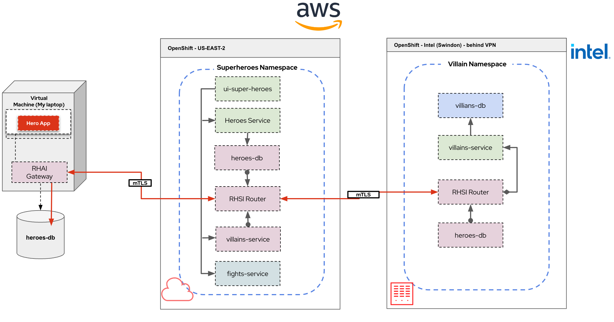

# Superheroes and Skupper demo

This demo focuses on Skupper configuration, Service Federatation and Remote database

Updated to RHSIL 2.1

Connection 

My Laptop <---------- Azure ----------> AWS

## Introduction

The purpose of this demo is to show how easy it is to setup Skupper. I choose to use the Superheroes demo because its microservice architecure. It makes it very to use Skupper with.

The demo uses 2 OpenShift clusters, really doesn't matter which or where you deploy them. Clearly, the bigger the seperation, the more effective the demo is. I also use a local database running on my laptop.

Here is an architecture diagram of the application:


Here is how the distribution will be set up:

I have chosen to split the villain service out on to a seperate cluster using Skupper and exposing the service. 

For the Heroes service.... I have hosted a mysql DB on my laptop that containes a table with the data in.

The demo will use a Skupper Gateway to expose the mysql DB to the Skupper Virutal application network.

Having exposed the database, Debezium is used to replicated the database, and then replicate changes to Kafka (either running on the OpenShift cluster, or usinf RHOSAK).

A small Camel K Integration will read the messages from Kafka and route them to the Postgres DB, allowing the full application to work.

## Setting up the Demo

### Deploy 2 OpenShift clusters

Choose one of the 2 clusters to host the Superheroes fight game. Typically choose the most public cluster if you have one.

I'm normally using AWS hosted and demolab

### Deploy the demo

Clone this repo so you can run the commands locally

#### Create the superheroes namespace in the public cluster

```
oc new-project superheroes
```

#### Deploy the application into the superheroes namespace

* clone the repository

  ```
  git clone https://github.com/pprosser-redhat/quarkus-super-heroes.git
  ```

* deploy the whole application into the superheroes namespace

   cd to the root of the cloned project

   ```
   oc apply -f deploy/k8s/java21-openshift.yml
   ```

   If you see problems with the fight service starting , try switching the fights-db to recreate update strategy and restart rollouts.

   remove the villain service so it can be deployed in the other cluster

   ```
   oc delete all -l app.kubernetes.io/part-of=villains-service
   ```

   remove the heroes service so it can be deployed in the other cluster

   ```
   oc delete all -l app.kubernetes.io/part-of=heroes-service
   ```

   update the "rest-heroes-config" configmap
   
   change the property quarkus.hibernate-orm.database.generation=validate

   to

   quarkus.hibernate-orm.database.generation=none

* deploy the villain service to the 2nd OpenShift cluster

  oc to the second cluster

  create a new namespace 

  ```
  oc new-project villains
  ```

  deploy the villain service

  ```
  oc apply -f rest-villains/deploy/k8s/native-kubernetes.yml
  ```

    deploy the villain service

  ```
  oc apply -f rest-heroes/deploy/k8s/native-kubernetes.yml
  ```

     remove the heroes database

   ```
   oc delete all -l app=heroes-db
   oc delete all -l name=heroes-db 
   ```

  Demo code should all now be deployed

In the terminal windows you are using for the skupper cli, ensure you set KUBECONFIG

For the cloud site use :-
```
export KUBECONFIG=$HOME/.kube/config-rosa
```

For the on premises env use :-

```
export KUBECONFIG=$HOME/.kube/config-coffee
```
Don't for to set your skupper platform in the terminal windows
```
export SKUPPER_PLATFORM=kubernetes
```

2. RHEL Skupper

```
export SKUPPER_PLATFORM=podman
```

# Demo Instructions

## Get the fight app up (URL will be different of course)

```
http://ui-super-heroes-superheroes.apps.rosa-zjs4n.tvaf.p1.openshiftapps.com/
```

## Initialise Skupper in each namespace

```
skupper site create rosa --enable-link-access
```
If not already done, install the network observer for monitoring using the operator
```
skupper site create intel
```

## Link the sites together (most private to the most public)
 

In rosa window
```
skupper token issue rosa.yaml
```
In intel window
```
skupper token redeem rosa.yaml
```
```
skupper link status
```
## Expose  the villain service on the intel side

On the Villains side
```
skupper connector create rest-villains 8084 --workload deployment/rest-villains
```
Check connector status

On the Superhereos side

```
skupper listener create rest-villains 8084
```

Check listener status

Check the game, villains should start appearing.... might need to refresh the page.

## Get data from my laptop by defining a skupper podman site and connect to rosa node

Before we can expose the heroes-service to the superheroes app, we need to fix up access to the heroes-db running on the laptop

```
skupper system install
```
```
skupper site create laptop
```
```
skupper system reload
```
```
skupper site status
```

## Link the sites (laptop to rosa) together (most private to the most public)
 

In rosa window
```
skupper token issue laptop.yaml
```
In intel window
```
skupper token redeem laptop.yaml
```
```
skupper system reload
```
```
skupper link status
```


## Expose my database

on the laptop
```
skupper connector create heroes-db 5432 --host 10.0.2.2
```
```
skupper system reload
```

Check connector status

```
skupper connector status
```

Check links status

```
skupper link status
```

In the villains Openshift, define the listener

```
skupper listener create heroes-db 5432
```

```
skupper listener status
```

## Expose  the Heroes service on the intel side

On the Villains side
```
skupper connector create rest-heroes 8083 --workload deployment/rest-heroes
```
Check connector status

On the Superhereos side

```
skupper listener create rest-heroes 8083
```

Check listener status

Check the game, villains should start appearing.... might need to refresh the page.


## note for using podman sites, if you use a podman site to expose the DB then it doesn't seen to like working through vbox gateway to using postgres in the VM. Connection this way looks like 
```
skupper expose host rhel8 --address heroes-db  --port 5432 --target-port 6543 --host-ip 192.168.58.4
```

Test that I can connect to to DB, in a postgres pod on the villains project

```
psql --dbname=heroes_database --host=heroes-db --username=superman --password
```
```
select id, name, othername from hero;
select id, name, othername from hero where name = 'Chewbacca';
```

