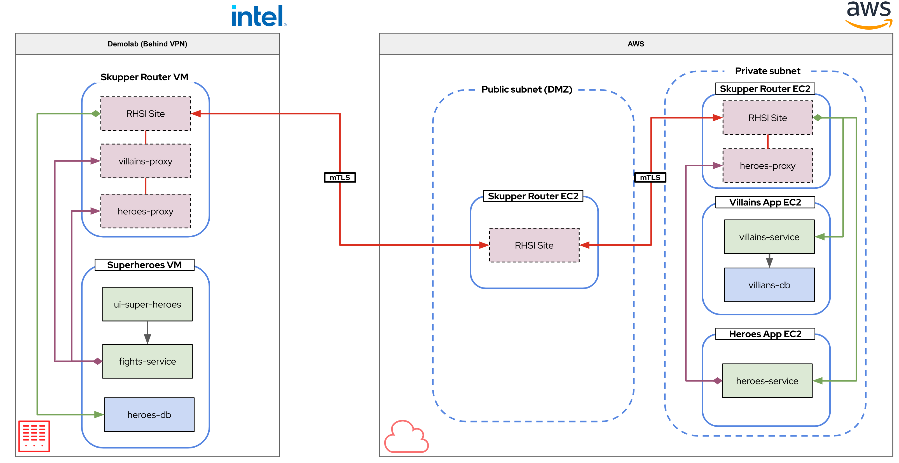

# Skupper sites on podman demo

The purpose of this demo is to install and configure skupper on podman to link services over TCP running on premises and in the cloud on AWS securely. All services are running in VM's either on premises behind a VPN or in AWS behind a DMZ. DMZ is created using a VPC and subnets.

## Demo Archtecture



## Note on ssh'ing to the VMS on the cloud

running with a private subnet means you cannot connect directly to the VM, you have to jump via the public subnet VM

ssh into the public vm, abd from there, ssh to the private VM

## Install Skupper 

All DNS name and IP addresses are all specific for one environment - need swapping out for a rerun of the demo

### Install skupper in AWS DMZ subnet

ssh to public DNS of skupper-public VM

```
export SKUPPER_PLATFORM=podman
```

```
skupper init --site-name aws-public --ingress-host ec2-3-249-30-121.eu-west-1.compute.amazonaws.com
```

### Install skupper in Demolab
```
export SKUPPER_PLATFORM=podman
```

```
skupper init --site-name demolab --ingress-host skupper
```

### Install skupper in AWS private subnet

ssh to public DNS of skupper-public VM and then
ssh (jump) to private VM - skupper-private

```
export SKUPPER_PLATFORM=podman
```

```
skupper init --site-name aws-private --ingress-host ip-10-0-136-150.eu-west-1.compute.internal
```

## Link the sites together 

As per the demo architecture, and using the thought processs "most private to most public" going to link demolab to aws public, and aws private to aws public 

### Create token in AWS public

```
skupper token create ~/aws.yaml --name aws
```

### Create link from demolab to AWS public

In the demolab window

```
skupper link create --name demolab-to-aws-public  ~/aws.yaml
```

### Create link from AWS private to AWS public

In the AWS private window

```
skupper link create --name aws-private-to-aws-public  ~/aws.yaml
```

### Make sure the status of the links is checked 

```
skupper link status
skupper status
```

## Expose services to skupper - Villains

### Expose the villains service to skupper

In the AWS private window

Optional, expose the service and make it available for testing on the skupper private node

```
skupper expose host ip-10-0-129-108.eu-west-1.compute.internal --address rest-villains --port 8084 --target-port 8084 --host-ip 10.0.136.150
```
to delete the above (means that it will not be exposed on the private skupper router)

```
skupper unexpose host ip-10-0-129-108.eu-west-1.compute.internal --address rest-villains
```
**or**

```
skupper expose host ip-10-0-129-108.eu-west-1.compute.internal --address rest-villains --port 8084 --target-port 8084
```

## Make the service available in demolab - Villains

### rest-villains

```
skupper service create rest-villains 8084 --host-ip 10.50.2.244 --host-port 8084
```

## Expose services to skupper - Heroes
### Expose the heroes service to skupper

In the AWS private window

```
skupper expose host  ip-10-0-129-108.eu-west-1.compute.internal --address rest-heroes --port 8083 --target-port 8083
```

### Check the services are correct

```
skupper service status
```

### rest-heroes service

In demolab window
```
skupper service create rest-heroes 8083 --host-ip 10.50.2.244 --host-port 8083
```

Testing the service shows that rest-heroes still doesn't work! It's DB is in demolab.

## make the heroes-db available in AWS private

heros-db is in demolab and needs exposing

In demolab window

```
skupper expose host 10.50.2.208 --address heroes-db --port 5432 --target-port 5432
```

### hero-db service in private AWS

add the service definition to AWS private


```
skupper service create heroes-db 5432 --host-ip 10.0.136.150 --host-port 5432
```

## test hero-db using psql cli in AWS private skupper VM
If time permits, test accessing the heroes-db using psql across skupper....

```
psql --dbname=heroes_database --host=ip-10-0-136-150.eu-west-1.compute.internal --username=superman --password
```
```
select id, name, othername from hero;
select id, name, othername from hero where name = 'Chewbacca';
```